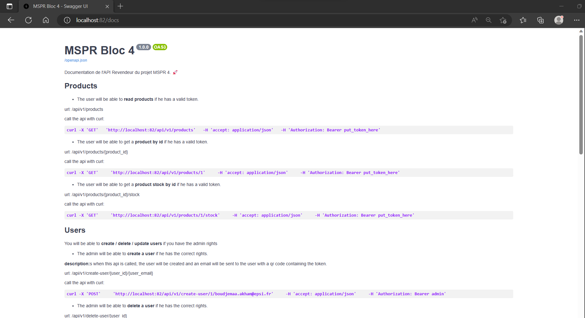
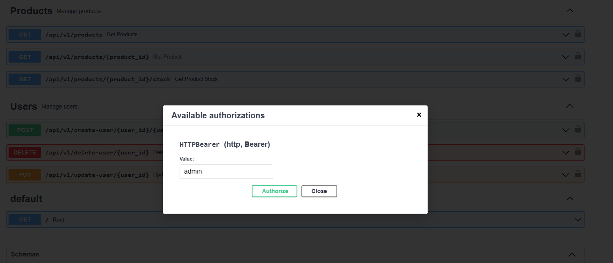
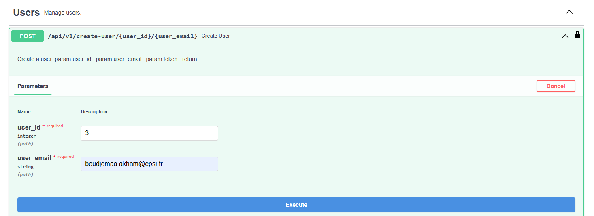
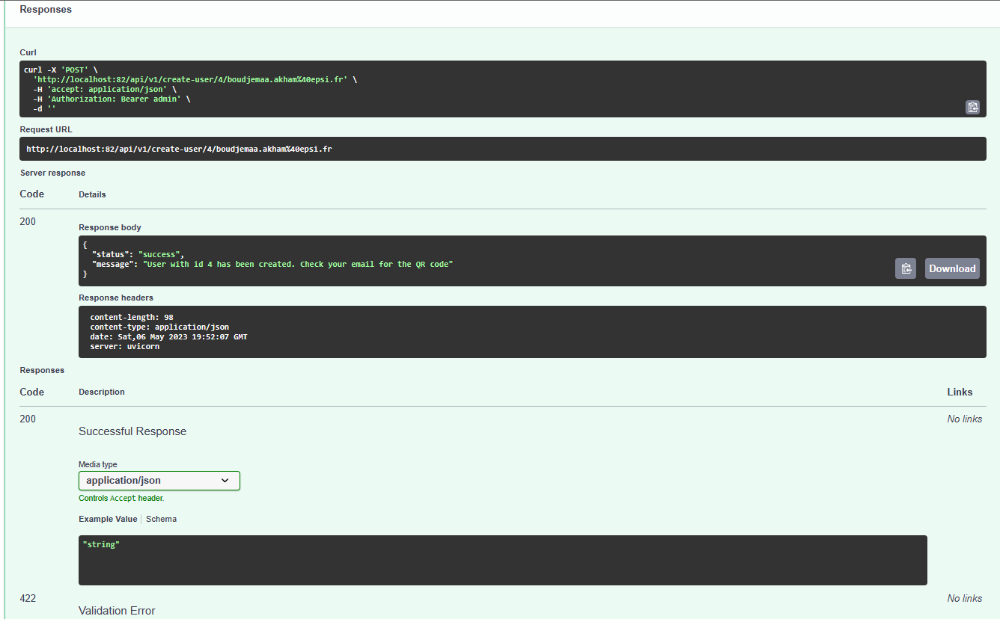
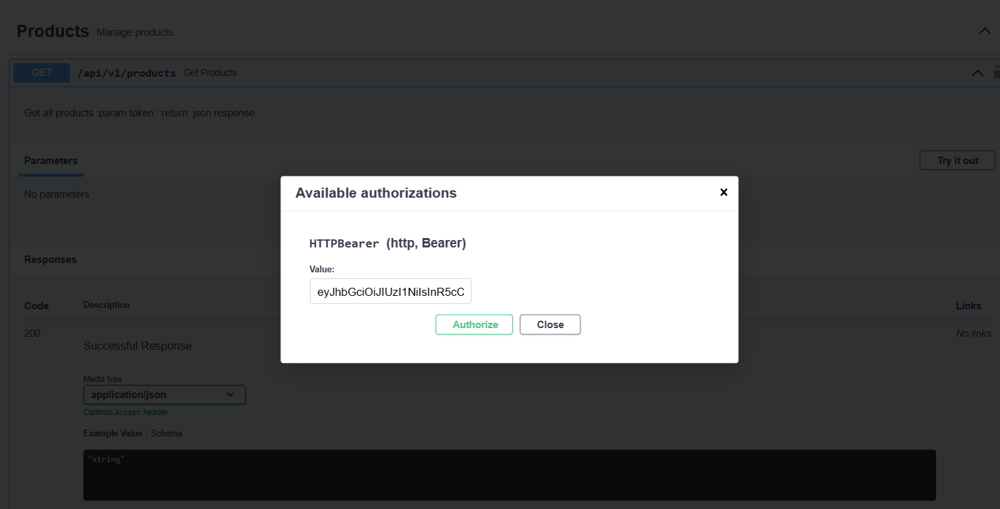
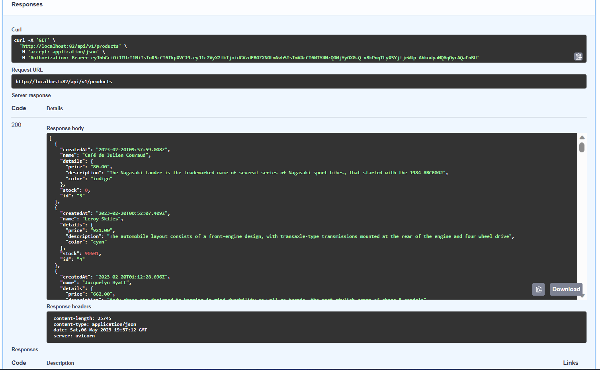

## Documentation utilisateur

### Prérequis

- Python 3.10    https://www.python.org/downloads/
- git            https://git-scm.com/downloads
- Docker         https://docs.docker.com/get-docker/
- Kubernetes     https://kubernetes.io/fr/docs/tasks/tools/install-kubectl/

### Installation

Voir le fichier [README.md](../README.md)

### Utilisation de l'application en local :

1 - Une fois l'application lancée, les routes de l'API et la documentation sont disponibles à l'adresse suivante :

http://localhost:82/docs

Vous devriez voir la documentation de l'API.

Note : le port 82 est configuré uniquement pour l'environnement de développement. Une fois l'application déployée en
production, le port 444 sera utilisé.

2 - Pour tester l'API, il faut d'abord créer un utilisateur en utilisant la route :

http://localhost:82/api/v1/create-user/{user_id}/{user_email}

Vous devez remplacer {user_id} et {user_email} par les valeurs de votre choix. Il faut utiliser une adresse email
valide.

Cliquer sur l'icone cadnas pour ouvrir la fenêtre d'authentification.

Puis saisir le token à utiliser est : admin

Cliquer sur Authorize pour valider.

Cliquer sur Try it out pour exécuter la requête.

Si la requête est exécutée avec succès, vous devriez voir le message suivant :

Vérifiez votre addresse mail et vous allez recevoir le qr code contenant le token d'authentication :

3 - Pour requeter les APIs Produit :

Scannez le QR code recu par email avec votre smartphone. Récupérez le token et utilisez le pour requeter les APIs
Produits.

Déconnectez vous avec le token admin et reconnectez vous avec le token produit.

Vous pouvez maintenant tester les APIs Produits.

Si la requête est exécutée avec succès, vous devriez voir le message suivant :

4 - Vous pouvez refaire les memes étapes pour tester les APIs Produits avec ID et le stock des produits.

